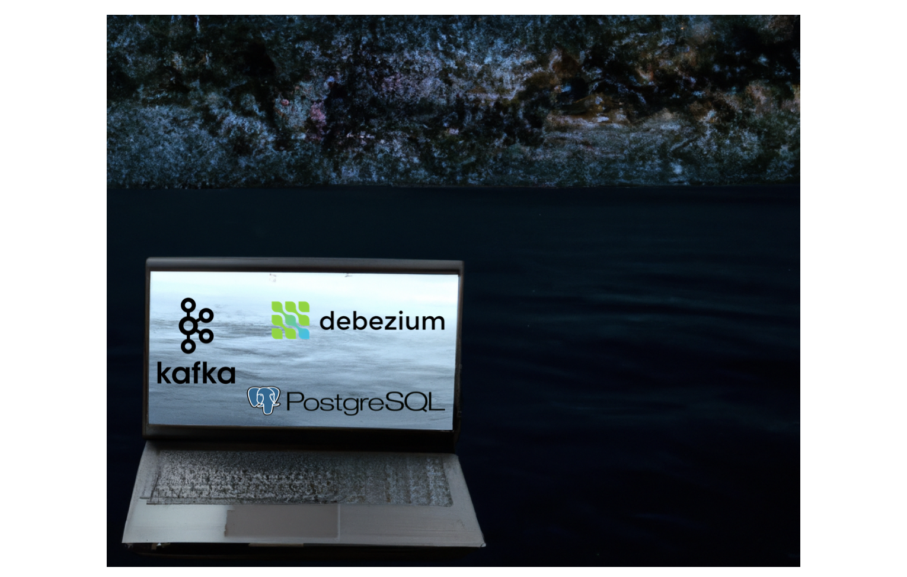

# Learning Tech: DIY Change Data Capture On Localhost


Hey there! So, imagine your data is like a lively neighborhood, and every day, 
new things are happening—new people moving in, kids starting school, and maybe 
some folks leaving. Now, change data capture (CDC) is like having a super 
observant neighbor who keeps tabs on all these happenings and lets you know 
what's different every day.

In tech terms, CDC is a cool way to track and capture changes in your database, 
like when new data is added, existing data is updated, or when something is 
deleted. It's like having a snapshot of your data's daily adventures, making 
it easier for you to stay in the loop without having to sift through the entire 
neighborhood gossip.

Setting up CDC is like putting on your neighborhood watch hat—it helps you 
keep track of all the comings and goings in your data world. 
So, let's build this system for free on our local laptop to better understand
how to monitor our data and the tools used! First, let's introduce the tools
that we are going to use: Postgres, Kafka, Debezium!

## Pre-requisites
We will be hosting all of these tools with [docker-compose](https://docs.docker.com/compose/). We will
also be building a very slim [python](https://www.python.org/) app which listens to a kafka topic.
Because of this, I will assume you have both docker-compose and python installed.

## Tools and Terminology
### Postgres
Finally, let's meet PostgreSQL, the unsung hero of the relational database world. 
If databases were superheroes, PostgreSQL would be the one quietly ensuring data 
integrity and reliability behind the scenes. This open-source, object-relational database 
system has been winning hearts for its extensibility, standards compliance, and robustness.

What sets PostgreSQL apart? Well, it goes beyond just storing data; it's your trustworthy 
companion for handling complex queries, transactions, and scaling with ease. Whether 
you're a small startup or a large enterprise, PostgreSQL's flexibility and adherence to 
SQL standards make it a go-to choice for developers and database administrators alike.


### Apache Kafka
[Kafka](https://kafka.apache.org/) is one of the backbones of the real-time data revolution. Picture it as the bustling 
central hub where data streams converge and diverge, forming a bustling metropolis of information 
exchange. Kafka ensures that no byte of data is left unexplored, connecting your applications in a 
seamless dance of communication.

At its core, Kafka is an open source distributed event streaming platform. That's a lot of dense wording,
but we can summarize it by saying that its a robust, flexible, and efficient PubSub platform. One end
will write to topics, and consumers will listen and react to the messages received from the publisher.
It helps decouple and scale our applications with asyncronous data processing.

### Debezium
Now, let's introduce Debezium, the game-changer in the realm of change data capture. 
Imagine a world where you not only store data but also capture every subtle change in 
real-time - that's the magic Debezium brings to the table.

Debezium acts as a connector between your databases and Apache Kafka, the distributed 
streaming platform. It taps into the database's transaction log, capturing every insert, 
update, or delete operation. This change data is then streamed to Kafka topics, creating a 
real-time pipeline of events that reflects the evolving state of your database.

Why is this important? Well, Debezium's Change Data Capture allows you to react instantly 
to database changes, opening doors to a plethora of use cases, from maintaining data 
replicas to triggering real-time analytics or feeding data into microservices architectures.

In simpler terms, Debezium is your data detective, keeping an eye on the ever-changing 
landscape of your database and broadcasting those changes to the rest of your data ecosystem.

## Part I: Hosting our services with compose
First, let's just start all of our services up.

Our entire `docker-compose.yml` file is below:

```yaml
version: '3.7'
services:
  database:
    image: postgres:14
    environment:
      - POSTGRES_DATABASE=cdctest
      - POSTGRES_USER=cdctest
      - POSTGRES_PASSWORD=cdctest
    command: 
      # Settings for debezium, at a minimum, 
      # is to enable wal_level=logical
      - postgres 
      - -c 
      - wal_level=logical 
      - -c 
      - max_wal_senders=10 
      - -c 
      - max_replication_slots=10 
    ports:
      - 55432:5432
    networks:
      - cdc-net
    volumes:
      - ./postgres/init.sql:/docker-entrypoint-initdb.d/01-init.sql
      
  zookeeper:
    image: wurstmeister/zookeeper:latest
    networks:
      - cdc-net

  kafka:
    image: wurstmeister/kafka:latest
    environment:
      KAFKA_ADVERTISED_HOST_NAME: kafka
      KAFKA_ADVERTISED_PORT: 9092
      KAFKA_CREATE_TOPICS: "cdctest.customers:1:1"
      KAFKA_ZOOKEEPER_CONNECT: zookeeper:2181
    networks:
      - cdc-net

  # We can create the connector with the REST API:
  # curl -i -X POST -H "Accept:application/json" -H "Content-Type:application/json" localhost:8083/connectors/ -d @/opt/debezium/customers_conf.json
  connect:
    image: debezium/connect:2.4
    environment:
      - GROUP_ID=1
      - CONFIG_STORAGE_TOPIC=cdc_connect_configs
      - OFFSET_STORAGE_TOPIC=cdc_connect_offsets
      - STATUS_STORAGE_TOPIC=cdc_source_connect_statuses
      - BOOTSTRAP_SERVERS=kafka:9092
    volumes:
      - ./debezium/:/opt/debezium:ro
    networks:
      - cdc-net

  app:
    # kafka-console-consumer.sh --topic cdctest.public.customers --bootstrap-server kafka:9092
    image: py-consumer
    build:
      context: ./python
    environment:
      - KAFKA_CDC_TOPIC=cdctest.public.customers
      - KAFKA_CDC_BOOTSTRAP_SERVERS=kafka:9092
    depends_on:
      - kafka
    networks:
      - cdc-net

networks:
  cdc-net:
    external: false
    name: cdc-net
```

We have five services:

First, we have the `database` service. This is our postgres service. We will
use postgres 14 here. CDC with Debezium requires a logical wal level, so we 
will enable that with `-c wal_level=logical`. We also increase our 
`max_wal_senders` and `max_replication_slots`, but note these are not required 
settings for Debezium. We will expose the container on port `55432` on our
local computer and we will run a few initializing sql commands in `./postgres/init.sql`.
The SQL is just simply used to create a `customers` table, which is what we 
will monitor with our Debezium connector.

Next, we have our zookeeper and kafka services. We won't dive too much
into zookeeper. For now, it is suffice to say that it will be used by
kafka. Kafka, on the other hand does have some configuration worth 
mentioning. Our kafka service has a few environment variables:
```shell
KAFKA_ADVERTISED_HOST_NAME=kafka
KAFKA_ADVERTISED_PORT=9092
KAFKA_CREATE_TOPICS=cdctest.public.customers:1:1
KAFKA_ZOOKEEPER_CONNECT=zookeeper:2181
```
Now, if you've used kafka in a docker container before, a lot of these
should look familiar. But the new one is the `KAFKA_CREATE_TOPICS` environment
variable. This tells kafka to create this topic when it starts up. The name,
however, seems a bit weird? It kind of looks like a database table's name with 
the format: `<database_name>.<database_schema>.<database_table>`. This is the
topic that debezium will use to publish changes/updates/deletes to kafka. 

Next, let's look at our `connect` (or debezium) service. This is the topic that
will connect to postgres, connect to kafka, and publish changes to kafka. It has a
few environment variables:

```shell
GROUP_ID=1
CONFIG_STORAGE_TOPIC=cdc_connect_configs
OFFSET_STORAGE_TOPIC=cdc_connect_offsets
STATUS_STORAGE_TOPIC=cdc_source_connect_statuses
BOOTSTRAP_SERVERS=kafka:9092
```

These four environment variables are required:

* `GROUP_ID`: Set this to an ID that uniquely identifies the 
    Kafka Connect cluster the service and its workers belong to.

* `CONFIG_STORAGE_TOPIC` - Set this to the name of the Kafka topic where the 
    Kafka Connect services in the group store  connector configurations.

* `OFFSET_STORAGE_TOPIC` - Set this to the name of the Kafka topic where the Kafka 
    Connect services in the group store connector offsets.

* `BOOTSTRAP_SERVERS` - Set this to a list of host/port pairs to use for 
    establishing the initial connection to the Kafka cluster.

All debezium docker environment configurations can be found [here](https://registry.hub.docker.com/r/debezium/connect).

We also mount this `debezium` folder into our container. This folder will house
our connector settings. Debezium allows you to configure your connectors
via a REST API on `localhost:8083`. This REST API accepts JSON bodies
to provision and create the connectors. Let's take a look at our one
configuration:

```json
{
	"name": "customer-cdc",
	"config": {
		"connector.class": "io.debezium.connector.postgresql.PostgresConnector",
		"database.hostname": "database",
		"database.port": "5432",
		"database.user": "cdctest",
		"database.password": "cdctest",
		"database.dbname": "cdctest",
		"database.server.name": "cdctest",
        "topic.prefix": "cdctest",
		"table.include.list": "public.customers",
        "plugin.name": "pgoutput"
	}
}
```

So, if we submit this to our REST API, we will create a connector with the name `customer-cdc`.
It will be of type `PostgresConnector`. It will connect to `database:5432` with the username
`cdctest` and the password `cdctest`. It will prefix all of the tables is monitors with `cdctest`
and it will monitor the table `public.customers`. So, here's where the kafka topic name (described above)
comes from! We will monitor `public.customers` and right changes to the `cdctest.public.customers` topic!

Our last service (`app`) is a simple python kafka app. Since this isn't really a python
blog, we won't go through it too much in depth, but you can find the source code [here]() 
if you are curious. For now, it is suffice to say that it will:

1. Connect to our kafka cluster
2. Consume from the `cdctest.public.customers` topic
3. Log the changes to the console

We can now start everything up:

```shell
prompt> docker-compose up -d
[+] Running 6/0
 ✔ Network cdc-net                                                                                                                                          Created0.0s 
 ✔ Container ez-cdc-connect-1                                                                                                                               Created0.0s 
 ✔ Container ez-cdc-zookeeper-1                                                                                                                             Created0.0s[+] Running 7/7
 ✔ Network cdc-net                                                                                                                                          Created0.0s 
 ✔ Container ez-cdc-connect-1                                                                                                                               Created0.0s 
 ✔ Container ez-cdc-zookeeper-1                                                                                                                             Created0.0s[+] Running 7/7
 ✔ Network cdc-net                                                                                                                                          Created0.0s 
 ✔ Container ez-cdc-connect-1                                                                                                                               Created0.0s 
 ✔ Container ez-cdc-zookeeper-1                                                                                                                             Created0.0s[+] Running 7/7
 ✔ Network cdc-net                                                                                                                                          Created0.0s 
 ✔ Container ez-cdc-connect-1                                                                                                                               Started0.0s 
 ✔ Container ez-cdc-zookeeper-1                                                                                                                             Created0.0s[+] Running 7/7
 ✔ Network cdc-net                                                                                                                                          Created0.0s 
 ✔ Container ez-cdc-connect-1                                                                                                                               Started0.0s 
 ✔ Container ez-cdc-zookeeper-1                                                                                                                             Started0.0s[+] Running 7/7
 ✔ Network cdc-net                                                                                                                                          Created0.0s 
 ✔ Container ez-cdc-connect-1                                                                                                                               Started0.0s 
 ✔ Container ez-cdc-zookeeper-1                                                                                                                             Started0.0s 
 ✔ Container ez-cdc-database-1                                                                                                                              Started0.0s 
 ✔ Container ez-cdc-kafka-1                                                                                                                                 Started0.0s 
 ✔ Container ez-cdc-app-1                                                                                                                                   Started0.0s 

prompt> docker-compose ps
NAME                 IMAGE                           COMMAND                  SERVICE     CREATED          STATUS          PORTS
ez-cdc-app-1         py-consumer                     "python main.py"         app         56 seconds ago   Up 55 seconds   
ez-cdc-connect-1     debezium/connect:2.4            "/docker-entrypoint.…"   connect     56 seconds ago   Up 55 seconds   8083/tcp, 8778/tcp, 9092/tcp
ez-cdc-database-1    postgres:14                     "docker-entrypoint.s…"   database    56 seconds ago   Up 55 seconds   0.0.0.0:55432->5432/tcp
ez-cdc-kafka-1       wurstmeister/kafka:latest       "start-kafka.sh"         kafka       56 seconds ago   Up 55 seconds   
ez-cdc-zookeeper-1   wurstmeister/zookeeper:latest   "/bin/sh -c '/usr/sb…"   zookeeper   56 seconds ago   Up 55 seconds   22/tcp, 2181/tcp, 2888/tcp, 3888/tcp
```

## Setting Up Our Connector
Let's go and setup our connector. We will do that by execing in to the `connect`
container and running a simple cURL command: 

```shell
prompt> docker-compose exec connect bash
[kafka@eefc386d2cd3 ~]$ curl -i -X POST -H "Accept:application/json" -H "Content-Type:application/json" localhost:8083/connectors/ -d @/opt/debezium/customers_conf.json
HTTP/1.1 201 Created
Date: Thu, 21 Dec 2023 13:44:21 GMT
Location: http://localhost:8083/connectors/customer-cdc
Content-Type: application/json
Content-Length: 415
Server: Jetty(9.4.51.v20230217)

{"name":"customer-cdc","config":{"connector.class":"io.debezium.connector.postgresql.PostgresConnector","database.hostname":"database","database.port":"5432","database.user":"cdctest","database.password":"cdctest","database.dbname":"cdctest","database.server.name":"cdctest","topic.prefix":"cdctest","table.include.list":"public.customers","plugin.name":"pgoutput","name":"customer-cdc"},"tasks":[],"type":"source"}
[kafka@eefc386d2cd3 ~]$ 
```

Now, let's go insert some data into our database:

```shell
prompt> export PGHOST=localhost
prompt> export PGPORT=55432
prompt> export PGUSER=cdctest
prompt> export PGPASSWORD=cdctest
prompt> psql
psql (14.7 (Homebrew), server 14.10 (Debian 14.10-1.pgdg120+1))
Type "help" for help.

cdctest=# insert into customers (first_name, last_name, email) VALUES ('alex', 'foley', 'alex.foley');
INSERT 0 1
cdctest=# insert into customers (first_name, last_name, email) VALUES ('john', 'doe', 'john.doe');
INSERT 0 1
cdctest=# select * from customers;
 id | first_name | last_name |   email    
----+------------+-----------+------------
  1 | alex       | foley     | alex.foley
  2 | john       | doe       | john.doe
(2 rows)

cdctest=# 
```

Now, let's look at the logs of our python app:

```shell
prompt> docker-compose logs app
app-1  | Unable connect to "kafka:9092": [Errno 111] Connect call failed ('172.26.0.2', 9092)
app-1  | 2023-12-21 13:42:19.877 | ERROR    | __main__:consume:29 - Would not connect... sleeping
app-1  | Unable connect to "kafka:9092": [Errno 111] Connect call failed ('172.26.0.2', 9092)
app-1  | 2023-12-21 13:42:20.878 | ERROR    | __main__:consume:29 - Would not connect... sleeping
app-1  | Unable connect to "kafka:9092": [Errno 111] Connect call failed ('172.26.0.2', 9092)
app-1  | 2023-12-21 13:42:21.881 | ERROR    | __main__:consume:29 - Would not connect... sleeping
app-1  | 2023-12-21 13:46:28.744 | INFO     | __main__:consume:47 - consumed: value={'schema': {'type': 'struct', 'fields': [{'type': 'struct', 'fields': [{'type': 'int32', 'optional': False, 'default': 0, 'field': 'id'}, {'type': 'string', 'optional': True, 'field': 'first_name'}, {'type': 'string', 'optional': True, 'field': 'last_name'}, {'type': 'string', 'optional': True, 'field': 'email'}], 'optional': True, 'name': 'cdctest.public.customers.Value', 'field': 'before'}, {'type': 'struct', 'fields': [{'type': 'int32', 'optional': False, 'default': 0, 'field': 'id'}, {'type': 'string', 'optional': True, 'field': 'first_name'}, {'type': 'string', 'optional': True, 'field': 'last_name'}, {'type': 'string', 'optional': True, 'field': 'email'}], 'optional': True, 'name': 'cdctest.public.customers.Value', 'field': 'after'}, {'type': 'struct', 'fields': [{'type': 'string', 'optional': False, 'field': 'version'}, {'type': 'string', 'optional': False, 'field': 'connector'}, {'type': 'string', 'optional': False, 'field': 'name'}, {'type': 'int64', 'optional': False, 'field': 'ts_ms'}, {'type': 'string', 'optional': True, 'name': 'io.debezium.data.Enum', 'version': 1, 'parameters': {'allowed': 'true,last,false,incremental'}, 'default': 'false', 'field': 'snapshot'}, {'type': 'string', 'optional': False, 'field': 'db'}, {'type': 'string', 'optional': True, 'field': 'sequence'}, {'type': 'string', 'optional': False, 'field': 'schema'}, {'type': 'string', 'optional': False, 'field': 'table'}, {'type': 'int64', 'optional': True, 'field': 'txId'}, {'type': 'int64', 'optional': True, 'field': 'lsn'}, {'type': 'int64', 'optional': True, 'field': 'xmin'}], 'optional': False, 'name': 'io.debezium.connector.postgresql.Source', 'field': 'source'}, {'type': 'string', 'optional': False, 'field': 'op'}, {'type': 'int64', 'optional': True, 'field': 'ts_ms'}, {'type': 'struct', 'fields': [{'type': 'string', 'optional': False, 'field': 'id'}, {'type': 'int64', 'optional': False, 'field': 'total_order'}, {'type': 'int64', 'optional': False, 'field': 'data_collection_order'}], 'optional': True, 'name': 'event.block', 'version': 1, 'field': 'transaction'}], 'optional': False, 'name': 'cdctest.public.customers.Envelope', 'version': 1}, 'payload': {'before': None, 'after': {'id': 1, 'first_name': 'alex', 'last_name': 'foley', 'email': 'alex.foley'}, 'source': {'version': '2.4.2.Final', 'connector': 'postgresql', 'name': 'cdctest', 'ts_ms': 1703166387948, 'snapshot': 'false', 'db': 'cdctest', 'sequence': '[null,"24284336"]', 'schema': 'public', 'table': 'customers', 'txId': 739, 'lsn': 24284336, 'xmin': None}, 'op': 'c', 'ts_ms': 1703166388457, 'transaction': None}} timestamp=1703166388741
app-1  | 2023-12-21 13:46:42.821 | INFO     | __main__:consume:47 - consumed: value={'schema': {'type': 'struct', 'fields': [{'type': 'struct', 'fields': [{'type': 'int32', 'optional': False, 'default': 0, 'field': 'id'}, {'type': 'string', 'optional': True, 'field': 'first_name'}, {'type': 'string', 'optional': True, 'field': 'last_name'}, {'type': 'string', 'optional': True, 'field': 'email'}], 'optional': True, 'name': 'cdctest.public.customers.Value', 'field': 'before'}, {'type': 'struct', 'fields': [{'type': 'int32', 'optional': False, 'default': 0, 'field': 'id'}, {'type': 'string', 'optional': True, 'field': 'first_name'}, {'type': 'string', 'optional': True, 'field': 'last_name'}, {'type': 'string', 'optional': True, 'field': 'email'}], 'optional': True, 'name': 'cdctest.public.customers.Value', 'field': 'after'}, {'type': 'struct', 'fields': [{'type': 'string', 'optional': False, 'field': 'version'}, {'type': 'string', 'optional': False, 'field': 'connector'}, {'type': 'string', 'optional': False, 'field': 'name'}, {'type': 'int64', 'optional': False, 'field': 'ts_ms'}, {'type': 'string', 'optional': True, 'name': 'io.debezium.data.Enum', 'version': 1, 'parameters': {'allowed': 'true,last,false,incremental'}, 'default': 'false', 'field': 'snapshot'}, {'type': 'string', 'optional': False, 'field': 'db'}, {'type': 'string', 'optional': True, 'field': 'sequence'}, {'type': 'string', 'optional': False, 'field': 'schema'}, {'type': 'string', 'optional': False, 'field': 'table'}, {'type': 'int64', 'optional': True, 'field': 'txId'}, {'type': 'int64', 'optional': True, 'field': 'lsn'}, {'type': 'int64', 'optional': True, 'field': 'xmin'}], 'optional': False, 'name': 'io.debezium.connector.postgresql.Source', 'field': 'source'}, {'type': 'string', 'optional': False, 'field': 'op'}, {'type': 'int64', 'optional': True, 'field': 'ts_ms'}, {'type': 'struct', 'fields': [{'type': 'string', 'optional': False, 'field': 'id'}, {'type': 'int64', 'optional': False, 'field': 'total_order'}, {'type': 'int64', 'optional': False, 'field': 'data_collection_order'}], 'optional': True, 'name': 'event.block', 'version': 1, 'field': 'transaction'}], 'optional': False, 'name': 'cdctest.public.customers.Envelope', 'version': 1}, 'payload': {'before': None, 'after': {'id': 2, 'first_name': 'john', 'last_name': 'doe', 'email': 'john.doe'}, 'source': {'version': '2.4.2.Final', 'connector': 'postgresql', 'name': 'cdctest', 'ts_ms': 1703166402653, 'snapshot': 'false', 'db': 'cdctest', 'sequence': '["24284632","24284688"]', 'schema': 'public', 'table': 'customers', 'txId': 740, 'lsn': 24284688, 'xmin': None}, 'op': 'c', 'ts_ms': 1703166402765, 'transaction': None}} timestamp=1703166402803
prompt> 
```

Whoa! Look at that! Our two test users flowed into our python app in almost real time!

Here's a video representation below so its easier to see!
